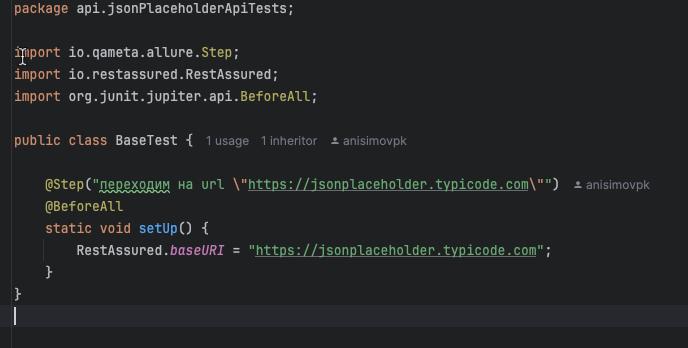

# README: Тестовый фреймворк на Java

## Введение

Добро пожаловать в тестовый фреймворк на Java! Этот фреймворк предназначен для автоматизации API и UI тестирования с использованием современных инструментов, таких как **Allure**, **Selenide**, **Serenity**, **RestAssured** и **JUnit 5**. Он подходит как для новичков, так и для опытных тестировщиков. Структура фреймворка следует лучшим практикам индустрии, что делает его удобным для масштабирования и интеграции в любой проект.

### Основные особенности:
- **Allure** для детализированных отчетов.
- **Selenide** для автоматизации взаимодействий с веб-элементами.
- **RestAssured** для тестирования API.
- **JUnit 5** для организации и запуска тестов.
- **Serenity** для удобного написания BDD-тестов.

---
### Системные требования
Убедитесь, что на вашем компьютере установлены следующие программы:
- **Java 11** или новее.
- **Maven**.
- **Git**.

### Структура проекта
Проект организован по следующей структуре:
- src/test/java — содержит все тесты и вспомогательные классы.
- api — API-тесты, использующие RestAssured.
- ui — UI-тесты, использующие Selenide.
- steps — шаги для тестов, которые включают действия и проверки.
```bash
src
└── main
    └── java
        └── dataqa
            ├── api
            │   └── page_object
            │       └── UserApi.java  // Класс для взаимодействия с API. 
            │                          // Содержит методы для выполнения HTTP-запросов (GET, POST) для работы с пользователями.
            └── mainPage
                └── page_object
                    ├── pages
                    │   └── ElementsPage.java  // Класс, представляющий страницу с элементами. 
                    │                               // Содержит методы для взаимодействия с элементами формы и проверки их значений.
                    └── utils
                        └── Selectors.java  // Утилитарный класс для определения селекторов для поиска элементов на страницах по различным атрибутам (id, class, name и т.д.).
└── test
    └── java
        ├── api
        │   └── jsonPlaceholderApiTests
        │       ├── ApiTests.java  // Тестовый класс для выполнения API-тестов. Содержит тестовые методы, которые используют шаги из UserApiSteps.
        │       ├── BaseTest.java  // Базовый класс для настройки окружения для API-тестов (установка базового URI).
        │       └── steps
        │           └── UserApiSteps.java  // Класс с шагами для выполнения действий с API, использующий методы из UserApi.
        └── ui
            └── demoqaUiTests
                ├── textBoxTests
                │   ├── TextBoxTests.java  // Тестовый класс для выполнения UI-тестов на странице с текстовыми полями. Содержит тестовые методы, использующие шаги из TextBoxSteps.
                │   └── steps
                │       └── TextBoxSteps.java  // Класс с шагами для выполнения действий на UI-страницах, использующий методы из ElementsPage.
                └── BaseTest.java  // Базовый класс для настройки окружения для UI-тестов (установка базового URL и конфигурации браузера).
```
## Как начать
1) Запросите доступ к клонированию проекта с репозитория
2) Используя команду:
```bash
git clone https://github.com/panisimov812/qa-project.git
```

### Шаг 2: Сборка проекта
Для сборки проекта выполните следующую команду:
```bash
./gradlew build
```

### Шаг 3: Запуск тестов
Перед запуском тестов убедитесь что вы находитесь в дериктории с тестами /qa-project
1) команда pwd выводит полный путь текущей директории,
2) команда ls отображает список файлов и папок в текущей директории.
3) команда cd для смены текущей директории.
4) команда cd .. перемещает вас на один уровень выше в файловой системе

- Для запуска всех тестов в классе, (на скриншоте номер 1) перейдите в класс с тесами и нажмите на зеленый треугольник рядом с именем класса
- Для запуска определенного теста в классе, (на скриншоте номер 2) нажмите на зеленый треугольник рядом с тестом

3) запуск теста через консоль 

```bash
./gradlew clean test;
```
### Шаг 4: Генерация отчета Allure
После выполнения тестов сгенерируйте отчет Allure:
```bash
./gradlew allureServe
```
Отчет будет доступен в вашем браузере по умолчанию (скрин №1 и скрин №2).

скрин №1

скрин №2


## КАК ЭТО РАБОТАЕТ?

Page Object Model — это подход, при котором каждая веб-страница представляется отдельным классом. 
В этом классе описаны элементы страницы и методы для взаимодействия с ними. В результате, тестовые сценарии становятся проще и понятнее, так как используют высокоуровневые методы вместо работы с селекторами напрямую.
Основные преимущества:

1) Разделение кода тестов и описания страниц
2) Объединение всех действий по работе с веб-странией в одном месте

## Давайте посмотрим, как с этим работать.

Для примера возьмём наш тестовый сайт  https://demoqa.com/text-box и посмотрим как работают UI тесты

1) Создадим класс с описание этой страницы, используя шаблон Page Object и вспомогательный класс для работы с элементами страницы. 
В нашем случае это класс будет класс ```ElementsPage``` который находится по пути ```package dataqa.mainPage.page_object.pages;```
и класс ```Selectors``` который находится по пути ```package utils```;

Давйте разберем данный классы

```ElementsPage``` — это класс, который представляет страницу с элементами и методами для взаимодействия с ними. 
Здесь используются селекторы из класса Selectors для нахождения полей ввода и кнопки отправки на странице. 
Методы этого класса описывают действия, которые пользователь может выполнять на странице, например, ввод данных в поля
или нажатие на кнопку.

Под пунктом ```1``` у нас находится описание полей которые мы будем заполнять на сайте (смотри скрин #3)

скрин №3


Обращение к полям внутри данного класс происходит через вспомогательный класс ```Selectors``` данный класс создан для
удобства и масштабируемости фреймворка. 

Внутри класса находятся статических методов для поиска элементов на веб-странице.
Он использует различные стратегии для нахождения элементов по их атрибутам (см. скрин №4), например, по ```id, class, name, data-testid```,

скрин №4


Эти методы возвращают объекты типа ```By```, которые Selenium (или в нашем случае Selenide) использует для поиска элементов.
- Пример метода из класса ```Selectors```:
- ```byID(String id)```: находит элемент на странице по его атрибуту id. Возвращает селектор CSS, в котором используется 
символ ```#``` для указания ```id``` элемента, например: ```#userName```.
Важно понимать что тот класс ```Selectors``` позволяет сократить дублирование кода, так как можно просто использовать 
готовые методы для поиска элементов на странице вместо того, чтобы каждый раз писать ```CSS``` или ```XPath``` селекторы вручную.

2) Теперь давайте посмотрим как в классе ```ElementsPage``` происходит обращение к полям
- заполнение полей
- нажатие на кнопку
- проверка 

**fillEmail(String email)**

Этот метод отвечает за заполнение поля электронной почты на веб-странице.

	•	$(EMAIL_INPUT) — здесь используется селектор EMAIL_INPUT, который хранит информацию о том, где на странице находится поле для ввода email (он был получен через метод Selectors.byID("userEmail")).
	•	.setValue(email) — это действие Selenide, которое вводит переданное значение email в найденное поле.

**currentAddress(String currentAddress)**

Метод аналогичен fillEmail, но отвечает за ввод текущего адреса пользователя в соответствующее поле.

	•	$(CURRENT_ADDRESS_INPUT) — находит поле текущего адреса (через селектор byID("currentAddress")).
	•	.setValue(currentAddress) — вводит переданное значение currentAddress.

**permanentAddress(String permanentAddress)**

Тот же принцип, что и в предыдущих методах, только работает с полем постоянного адреса.

	•	$(PERMANENT_ADDRESS_INPUT) — находит поле постоянного адреса.
	•	.setValue(permanentAddress) — вводит переданное значение.

**clickSubmitBtn()**

Этот метод кликает на кнопку “Submit”, чтобы отправить форму.

	•	$(SUBMIT_BUTTON) — находит кнопку по селектору SUBMIT_BUTTON.
	•	.click() — кликает на найденную кнопку.

**completedFormShouldHaveInfo(String fullName, String email, String currentAddress, String permanentAddress)**

Этот метод проверяет, что форма была успешно заполнена, и что все данные, которые ввел пользователь, присутствуют на странице.

	•	$(COMPLETE_FORM) — находит контейнер с заполненной формой, который имеет класс "border col-md-12 col-sm-12".
	•	.shouldHave(text(fullName), text(email), text(currentAddress), text(permanentAddress)) — это проверка Selenide, которая гарантирует, что указанные данные (имя, email, текущий и постоянный адрес) отображаются на странице.


## Написание шагов для теста

После того как мы описали страницу следует добавить описание шагов которые будут использоваться в тесте.
Начнем с класса ```TextBoxSteps```

Класс ```TextBoxSteps``` — это шаги для выполнения конкретных действий в тестах. Он использует методы из ElementsPage 
для выполнения шагов и добавляет аннотацию @Step из Allure, чтобы тесты были более информативными.

Каждый метод в этом классе — это один шаг теста (смотри скрин №5):

	•	fillFullName(String fullName) — вызывает метод fillFullName из ElementsPage, чтобы ввести имя.
	•	clickBtn() — вызывает метод clickSubmitBtn() из ElementsPage, чтобы нажать на кнопку.

скрин №5 


**Как классы взаимодействуют?**

	1.	Класс ElementsPage:
	•	Этот класс содержит локаторы элементов страницы и методы для работы с ними. Например, он знает, как найти поле для имени и как ввести туда данные.
	2.	Класс TextBoxSteps:
	•	Этот класс использует методы из ElementsPage, чтобы выполнить конкретные шаги в тестах. Он не работает напрямую с селекторами, а лишь вызывает методы ElementsPage, тем самым абстрагируя логику работы с элементами страницы.
	•	Благодаря аннотациям @Step, каждый шаг можно легко отслеживать в отчётах Allure(скрин №2) , что упрощает отладку и анализ результатов тестов.

## Подготовка теста и объединение вышеописанного в единую структуру

Этот пример показывает, как реализованы тесты с использованием паттерна Page Object и шагов
тестирования (Steps) с помощью фреймворков JUnit и Allure для автоматизации тестирования веб-приложений.
Взаимодействие между классами организовано таким образом, чтобы отделить логику работы с элементами страницы, шаги теста и сами тестовые сценарии.

1. Класс ```ElementsPage``` (Page Object)

Класс ```ElementsPage``` содержит методы для взаимодействия с веб-элементами на странице “Text Box” на сайте demoqa.com. 
Здесь определены селекторы и методы для заполнения форм и нажатия кнопки.

	•	Основная роль: работа с веб-страницей. 
	•	Этот класс инкапсулирует детали взаимодействия с элементами через селекторы, используя Selenide для поиска и 
	•	взаимодействия с элементами страницы.

Пример методов:

	•	fillFullName(String fullName) — заполняет поле “Full Name”.
	•	clickSubmitBtn() — нажимает на кнопку “Submit”.
	•	completedFormShouldHaveInfo(...) — проверяет, что заполненная информация отображается корректно.

2. Класс ```TextBoxSteps``` (Steps)

Класс ```TextBoxSteps``` использует методы из ```ElementsPage``` для выполнения шагов теста. 
Он не работает напрямую с веб-элементами, а только вызывает методы из ```ElementsPage```, чтобы упростить и сделать 
шаги теста понятными и абстрагировать низкоуровневую логику.

Пример шагов:

	•	fillFullName(String fullName) — вызывает метод fillFullName() из ElementsPage, заполняя поле “Full Name”.
	•	clickBtn() — вызывает метод для нажатия на кнопку.
	•	completedFormShouldHaveInfo(...) — проверяет, что все поля заполнены корректно.

3. Класс TextBoxTests (Тесты)

Класс TextBoxTests содержит конкретный тестовый сценарий. Он использует шаги из TextBoxSteps для выполнения тестов. 
В данном случае, тест заполняет все поля на странице, нажимает на кнопку “Submit” и проверяет, что введённые данные отображаются корректно.

•	Основная роль: организует тесты и управляет их запуском. Он использует шаги (методы из TextBoxSteps), чтобы выполнить конкретный сценарий.

Тестовый метод fillAllForms():

	1.	Определяет тестовые данные (имя, email, адреса).
	2.	Вызывает методы из TextBoxSteps для заполнения полей формы и нажатия на кнопку “Submit”.
	3.	Проверяет, что введённые данные правильно отображаются на странице после отправки формы.

4. Класс BaseTest 

скрин №6


Класс ```BaseTest``` отвечает за общие настройки для тестов. 
В методе ```setUp()``` настраивается браузер, который будет использоваться для тестов, и базовый URL, 
на который будут отправляться запросы.

	•	Основная роль: инициализация тестовой среды.

Метод ```@BeforeAll static void setUp()```:

	•	Устанавливает базовый URL (https://demoqa.com).
	•	Определяет браузер, который будет использоваться (например, Firefox). Тут можно сменить и на Safari и Chrome
	•	Задаёт размер окна браузера. Так же изменяется под ваши нужды

**Взаимодействие классов:**
1.	BaseTest подготавливает тестовую среду: указывает, какой браузер использовать и задаёт начальные параметры.
2.	TextBoxTests — это основной тестовый класс, который содержит тесты. Он вызывает методы из TextBoxSteps, чтобы провести тестирование.
3.	TextBoxSteps содержит шаги тестирования. В каждом шаге он вызывает методы из ElementsPage, чтобы взаимодействовать с веб-элементами.
4.	ElementsPage описывает структуру страницы и действия, которые можно с ней делать (ввод данных, нажатие на кнопку и проверка результата).

скрин №7

Итог

Классическое разделение на Page Object и Steps помогает улучшить читаемость и поддержку кода. 
Логика работы с элементами страницы находится в одном месте (в ElementsPage), 
а тестовые шаги и тесты описаны отдельно (в TextBoxSteps и TextBoxTests соответственно). Это облегчает масштабирование
и изменение тестов, так как в случае изменений на странице нужно будет обновить только локаторы в ElementsPage, не изменяя сами тесты.


## ПОДГОТОВКА BACKEND ТЕСТОВ

Начнем с взаимодействие классов при API тестировании

1. Класс ```UserApi``` (Page Object)

Этот класс представляет собой объект страницы для API и отвечает за отправку HTTP-запросов к конечной точке ```/users```. 
Он инкапсулирует логику работы с API и содержит методы для различных типов запросов (например, ```GET``` и ```POST```
Даннный класс находится по пути ```package dataqa.api.page_object;``` а основной ролью является управление запросами к API.

скрин №8


Пример методов:

	•	getUser(int userId) — выполняет GET-запрос для получения данных о пользователе по его ID.
	•	createUser(String requestBody) — выполняет POST-запрос для создания нового пользователя с использованием тела запроса в формате JSON.

2. Класс ```UserApiSteps``` (Steps)

Класс ```UserApiSteps``` использует методы из ```UserApi``` для выполнения шагов тестирования. 
В этом классе происходит проверка корректности ответов API с использованием ```RestAssured``` и
```Hamcrest``` для ассертов. Все шаги логируются с помощью аннотации ```@Step``` из ```Allure```, 
что позволяет видеть каждый шаг в отчётах.
скрин №9


	•	Основная роль: организация шагов тестирования API с проверкой корректности ответов.

Пример шагов:

	•	getUserAndCheckUsername(int userId, String expectedUsername) — отправляет запрос на получение данных о пользователе и проверяет, что возвращённое имя пользователя совпадает с ожидаемым.
	•	createUserAndCheckResponse(String requestBody) — отправляет запрос на создание нового пользователя и проверяет, что возвращённые данные соответствуют ожиданиям.

3. Класс ```ApiTests``` (Тесты)

скрин №10

Класс ```ApiTests``` содержит конкретные тестовые сценарии. Он вызывает методы из ```UserApiSteps``` для выполнения тестов. 
Каждый тест описывает конкретный случай использования API, например, получение данных о пользователе или 
создание нового пользователя.

	•	Основная роль: организация и выполнение тестов.

Пример тестов:

	•	getUserTest() — проверяет, что запрос к /users/{id} возвращает правильного пользователя по его ID.
	•	createPostTest() — проверяет, что создание нового поста возвращает корректные данные в ответе.


Взаимодействие классов:

1. ApiTests — это тестовый класс, который содержит тестовые сценарии. Он использует шаги тестирования, реализованные в UserApiSteps, для выполнения запросов и проверки ответов.
2. ApiSteps — класс шагов тестирования, который взаимодействует с UserApi для отправки запросов к API и проверяет ответы. Каждый шаг сопровождается аннотацией @Step для Allure, что делает процесс тестирования более понятным и визуализированным в отчётах.
3. Api — это объект страницы (Page Object), который инкапсулирует взаимодействие с API. Он содержит методы для отправки запросов (GET, POST) и возвращает ответы.


```BaseTest``` используется как базовый для всех API тестов.
Он выполняет подготовку окружения перед запуском тестов,
чтобы задать общие настройки для RestAssured, такие как базовый URL.
Благодаря этому не нужно каждый раз указывать полный адрес 
в каждом запросе — все тесты будут отправляться на заданный базовый URL.


Описание работы:

	1.	Метод setUp()
	•	Этот метод помечен аннотацией @BeforeAll, что означает его выполнение один раз перед запуском всех тестов в классе. Это полезно, так как позволяет настроить общее окружение для всех тестов и избежать дублирования кода.
	•	В методе вызывается RestAssured.baseURI, устанавливающая базовый URL для всех последующих запросов. В данном случае, это https://jsonplaceholder.typicode.com — адрес сервиса, с которым будут работать тесты.
	•	Аннотация @Step от Allure позволяет логировать этот шаг в отчётах, чтобы было видно, что настройка окружения была выполнена.

Пример сценария использования:

	1.	Когда тест из класса ApiTests запускается, метод setUp() вызывается первым и устанавливает базовый URL для всех API запросов. Это экономит время и уменьшает количество кода, так как в каждом запросе будет использоваться уже установленная базовая часть URL.
	2.	После этого любые тесты, использующие RestAssured, могут отправлять запросы с относительными путями. Например, вызов get("/users/1") в тесте будет автоматически отправлен на полный URL https://jsonplaceholder.typicode.com/users/1.

Преимущества:

	•	Централизованная настройка: Все настройки окружения (в данном случае — базовый URL) вынесены в одно место, что упрощает поддержку кода.
	•	Переиспользование кода: Благодаря использованию базового класса все тесты наследуют эту настройку, избегая дублирования конфигурации в каждом тестовом классе.
	•	Интеграция с Allure: Логирование этого шага делает тесты более прозрачными, поскольку в отчётах будет видно, что настройка окружения была выполнена перед тестами.


Пример сценария взаимодействия:

	1.	Тестирование получения данных пользователя:
	•	Тест getUserTest() в классе ApiTests вызывает метод getUserAndCheckUsername() из UserApiSteps, чтобы получить данные пользователя с ID 1.
	•	В UserApiSteps вызывается метод getUser(int userId) из класса UserApi, который отправляет GET-запрос к API и возвращает ответ.
	•	Ответ проверяется на статус 200 и наличие правильного имени пользователя в теле ответа.
	2.	Тестирование создания пользователя:
	•	Тест createPostTest() в классе ApiTests вызывает метод createUserAndCheckResponse() из UserApiSteps, чтобы создать нового пользователя с помощью POST-запроса.
	•	В UserApiSteps вызывается метод createUser(String requestBody) из UserApi, который отправляет запрос с телом JSON к API.
	•	Ответ проверяется на статус 201 и правильность данных в теле ответа.

Итог:

	•	Separation of Concerns (Разделение обязанностей): UserApi отвечает за запросы к API, UserApiSteps — за логирование шагов и проверку ответов, а ApiTests — за выполнение конкретных тестовых сценариев.
	•	Паттерн Page Object позволяет инкапсулировать всю логику взаимодействия с API в одном месте, что упрощает поддержку и расширение кода.
	•	Шаги тестирования (Steps) позволяют детализировать процесс тестирования, а использование Allure делает этот процесс прозрачным и удобным для анализа.


## План масштабирования тестового фреймворка

1. Модули и Пакеты

   - Создание модульной структуры: Разделите фреймворк на модули для API и UI, каждый из которых будет содержать свои собственные тесты, страницы и шаги.
   - Пакеты для различных приложений: Создайте отдельные пакеты для различных приложений или сервисов, например:
   - api.userService
   - api.productService
   - ui.userInterface
   - ui.adminInterface


2. Конфигурация

    - Файлы конфигурации: Используйте файлы конфигурации (например, application.properties или config.json) для хранения параметров, 
   таких как базовые URL, учетные данные и другие настройки, чтобы легко менять их для разных сред.
   - Параметризация: Реализуйте возможность параметризации тестов, чтобы можно было легко запускать одни и те же тесты на разных окружениях (например, тестирование, предрелиз, продакшн).


3. Расширяемость методов

   - Создание базовых классов: Используйте базовые классы для общих действий (например, BaseApiTest, BaseUiTest) и наследуйте их в специфичных тестах.
   - Интерфейсы для API: Определите интерфейсы для API, чтобы упростить реализацию новых API-классов. 
   Это позволит добавлять новые API без изменений в существующем коде.


4. Универсальные селекторы

   - Универсальные селекторы: Оптимизируйте класс Selectors, добавив более общие методы для работы с элементами, чтобы уменьшить дублирование кода.
   - Пользовательские селекторы: Разработайте набор пользовательских селекторов для специфических случаев, чтобы упростить идентификацию элементов на разных страницах.


5. Генерация отчетов

   - Универсальные отчеты: Разработайте универсальные отчеты с использованием Allure, которые могут быть легко адаптированы для различных проектов.
   - Настройка отчетов: Позвольте конфигурировать уровень подробности отчетов и формат вывода (HTML, XML и т.д.).


6. Интеграция CI/CD

   - Интеграция с CI/CD: Настройте интеграцию с системами CI/CD (например, Jenkins, GitLab CI), чтобы автоматизировать запуск тестов при каждом коммите или перед деплоем.
   - Отчетность и уведомления: Настройте уведомления о результатах тестирования в реальном времени и автоматически создавайте отчеты по окончании тестов.


7. Документация и Примеры

   - Подробная документация: Создайте подробную документацию, включая примеры использования фреймворка для новых разработчиков и тестировщиков.
   - Примеры тестов: Добавьте наборы примеров тестов для различных сценариев использования, чтобы ускорить процесс внедрения.


8. Тестирование на разных устройствах и браузерах

   - Поддержка разных браузеров: Реализуйте поддержку различных браузеров и устройств, используя инструменты, такие как Selenium Grid или BrowserStack.
   - Параметризация браузера: Позвольте параметризовать браузер и его настройки (размер экрана, тип устройства) в конфигурационных файлах.


9. Использование шаблонов

   - Шаблоны для тестов: Создайте шаблоны для тестов, которые помогут разработчикам быстро начинать писать тесты для новых функций.
   - Универсальные шаги: Определите универсальные шаги, которые можно использовать в разных тестах, чтобы избежать дублирования кода.


10. Обратная связь и улучшения

    - Сбор обратной связи: Регулярно собирайте обратную связь от команды тестирования для улучшения фреймворка.
    - Анализ и улучшения: Периодически проводите анализ существующего кода и добавляйте новые функции на основе полученных отзывов.

Заключение

С помощью этих шагов вы сможете создать гибкий и масштабируемый тестовый фреймворк, который легко адаптируется под разные проекты и сайты.
